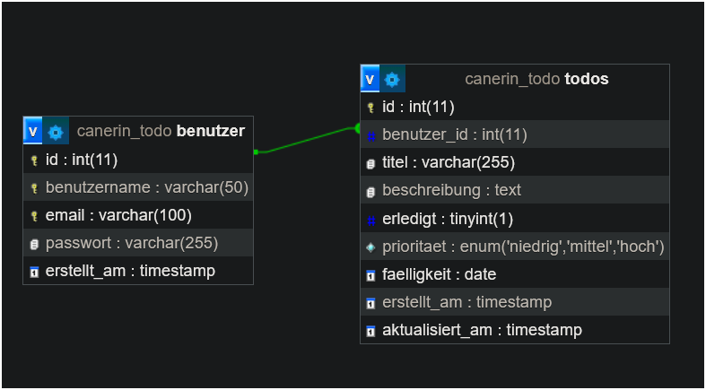

Diese Webanwendung ist eine funktionale „To-Do-Liste“, die grundlegende **CRUD-Operationen** (Anlegen, Lesen, Aktualisieren, Löschen) umfasst.

* **Backend:** Die Anwendung wurde serverseitig mit **PHP** entwickelt.
* **Datenmanagement:** Benutzerdaten und Aufgabenlisten sind auf einer **MySQL-Datenbank** optimiert.
* **Umfang:** Diese Arbeit wurde als **beispielhaftes Projekt** erstellt und verdeutlicht die Logik von Datenbankmanagement sowie dynamischer Content-Erstellung.

#### DEMO: [ https://cnr-todo.infinityfree.me/login.php](https://cnr-todo.infinityfree.me/login.php)

---

# CNR Todo - Installationsanleitung

## Voraussetzungen

- PHP 7.4 oder höher
- MariaDB/MySQL 5.7 oder höher
- Apache/Nginx Webserver
- XAMPP, WAMP, MAMP oder ähnliche lokale Entwicklungsumgebung

## Installation

### 1. Dateien einrichten

Kopieren Sie alle Projektdateien in Ihr lokales Webserver-Verzeichnis:

- Bei XAMPP: `C:\xampp\htdocs\canerin-todo\`
- Bei WAMP: `C:\wamp64\www\canerin-todo\`
- Bei MAMP: `/Applications/MAMP/htdocs/canerin-todo/`

### 2. Datenbank erstellen

**Option A: Mit phpMyAdmin**

1. Öffnen Sie phpMyAdmin (normalerweise unter `http://localhost/phpmyadmin`)
2. Klicken Sie auf "SQL" im oberen Menü
3. Kopieren Sie den gesamten Inhalt der Datei `database.sql`
4. Fügen Sie ihn in das SQL-Feld ein und klicken Sie auf "OK"

**Option B: Mit MySQL-Kommandozeile**

```bash
mysql -u root -p < database.sql
```

### 3. Datenbankkonfiguration anpassen (falls nötig)

Öffnen Sie die Datei `config.php` und passen Sie bei Bedarf die Datenbankzugangsdaten an:

```php
define('DB_HOST', 'localhost');   // oder 'localhost:3306' oder ihr Port
define('DB_NAME', 'canerin_todo');
define('DB_USER', 'root');        // Ihr MySQL-Benutzername
define('DB_PASS', '');            // Ihr MySQL-Passwort
```

### 4. Anwendung starten

1. Starten Sie Ihren lokalen Webserver (Apache) und MySQL/MariaDB
2. Öffnen Sie Ihren Browser
3. Navigieren Sie zu: `http://localhost/canerin-todo/`

## Projektstruktur

```
CNR_ToDo/
├── index.php                  - Startseite (leitet zu login.php weiter)
├── login.php                  - Anmeldeseite
├── register.php               - Registrierungsseite
├── dashboard.php              - Hauptseite mit Todo-Liste
├── logout.php                 - Abmelden
├── todo_actions.php           - CRUD-Operationen für Todos
├── license.txt                - Lizenzdatei
├── README.md                  - Diese Datei
├── core/
│   ├── config.php             - Datenbankkonfiguration und Hilfsfunktionen
│   └── database.sql           - Datenbank-Setup-Script
├── css/
│   └── style.css              - Alle Styles (responsive Design)
├── js/
│   └── main.js                - JavaScript Funktionen
├── image/                     - Bilder für die Anwendung
├── assets/                    - Assets und Ressourcen
│   └── img/                   - Bilder für README und Dokumentation
└── .git/                      - Git-Repository
```

## DB Design


