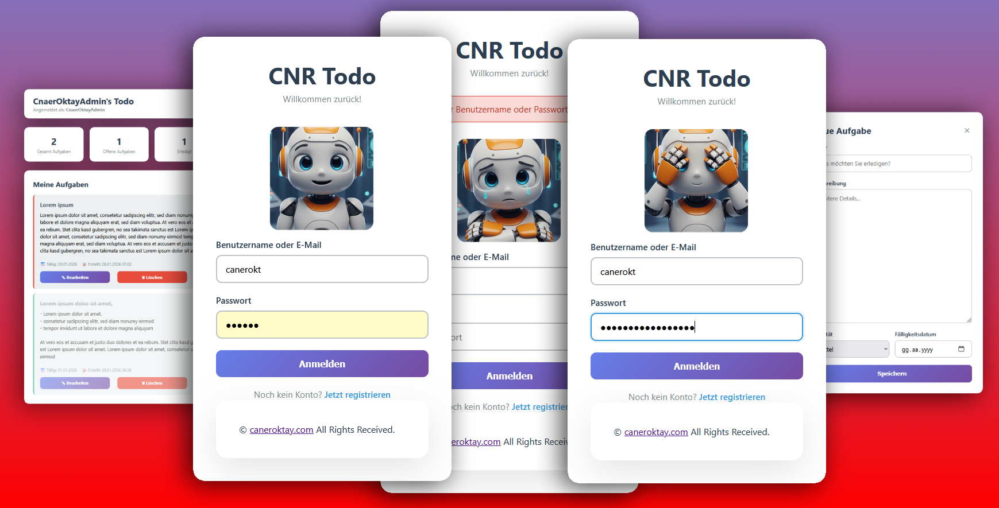
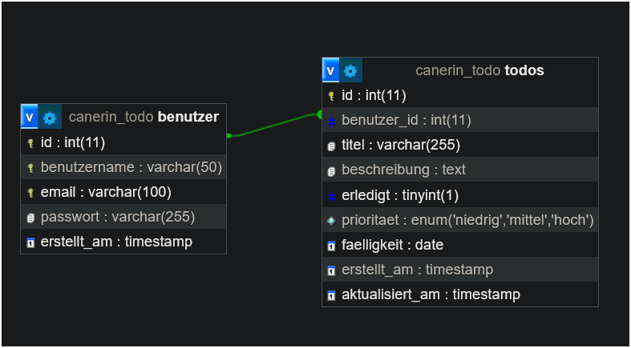

Diese Webanwendung ist eine funktionale „To-Do-Liste“, die grundlegende **CRUD-Operationen** (Anlegen, Lesen, Aktualisieren, Löschen) umfasst.

* **Backend:** Die Anwendung wurde serverseitig mit **PHP** entwickelt.
* **Datenmanagement:** Benutzerdaten und Aufgabenlisten sind auf einer **MySQL-Datenbank** optimiert.
* **Umfang:** Diese Arbeit wurde als **beispielhaftes Projekt** erstellt und verdeutlicht die Logik von Datenbankmanagement sowie dynamischer Content-Erstellung.

#### DEMO: [ https://cnr-todo.infinityfree.me/login.php](https://cnr-todo.infinityfree.me/login.php)

---

# CNR Todo - Installationsanleitung

## Voraussetzungen

* **Option A (klassisch):** XAMPP, WAMP veya MAMP (PHP 7.4+, MariaDB 5.7+)
* **Option B (Modern):** Docker & Docker Compose

## Lokale Installation

### 1. Dateien einrichten

Kopieren Sie alle Projektdateien in Ihr lokales Webserver-Verzeichnis:

- Bei XAMPP: `C:\xampp\htdocs\canerin-todo\`
- Bei WAMP: `C:\wamp64\www\canerin-todo\`
- Bei MAMP: `/Applications/MAMP/htdocs/canerin-todo/`

**Bei Docker :**

1. Erstellen Sie ein Projektverzeichnis: `~/Desktop/meinProjekt`
2. Kopieren Sie die PHP-Dateien in den Unterordner `./www/`
3. Stellen Sie sicher, dass die Dateien `docker-compose.yml` und `Dockerfile` im Hauptverzeichnis liegen.

### 2. Docker Setup (Nur für Docker-Nutzer)

Falls Sie Docker verwenden, führen Sie im Terminal folgenden Befehl aus:

**Bash**

```
docker compose up -d --build
```

> **Hinweis:** Dies startet automatisch den Apache-Server (Port 8080) und die MariaDB-Datenbank (Port 3306).

### 3. Datenbank erstellen

**Option A: Mit phpMyAdmin**

1. Öffnen Sie phpMyAdmin (normalerweise unter `http://localhost/phpmyadmin`)
2. Klicken Sie auf "SQL" im oberen Menü
3. Kopieren Sie den gesamten Inhalt der Datei `database.sql`
4. Fügen Sie ihn in das SQL-Feld ein und klicken Sie auf "OK"

 **Mit MySQL-Kommandozeile**

```bash
mysql -u root -p < database.sql
```

**Option B: Über Docker Terminal (Schnellimport)**

**Bash**

```
docker exec -i mariadb_database mysql -u root -proot canerin_todo < database.sql
```

### 4. Datenbankkonfiguration anpassen (falls nötig)

Passen Sie die Zugangsdaten in der  `core/config.php` an, je nachdem, welche Umgebung Sie nutzen:

```php
// Option A: --- FÜR XAMMP ---
define('DB_HOST', 'localhost');   	// oder 'localhost:3306' oder ihr Port ()
define('DB_NAME', 'canerin_todo');
define('DB_USER', 'root');        	// Ihr MySQL-Benutzername
define('DB_PASS', '');            	// Ihr MySQL-Passwort

// Option B: --- FÜR DOCKER ---
define('DB_HOST', 'db');         	// 'db' ist der Servicename im Docker-Netzwerk
define('DB_NAME', 'canerin_todo');
define('DB_USER', 'root');
define('DB_PASS', 'root');       	// Docker-Passwort ist 'root'

```

### 5. Anwendung starten

1. Starten Sie Ihren lokalen Webserver (Apache) und MySQL/MariaDB
2. Öffnen Sie Ihren Browser
   * **XAMPP:**`http://localhost/canerin-todo/`
   * **Docker:**`http://localhost:8080/`


## Fehlerbehebung (Docker Linux)

Falls Sie Berechtigungsprobleme im Ihren Ordnern haben:

**Bash**

```
sudo chown -R $USER:$USER .
chmod -R 755 .
```

---

## DB Design


